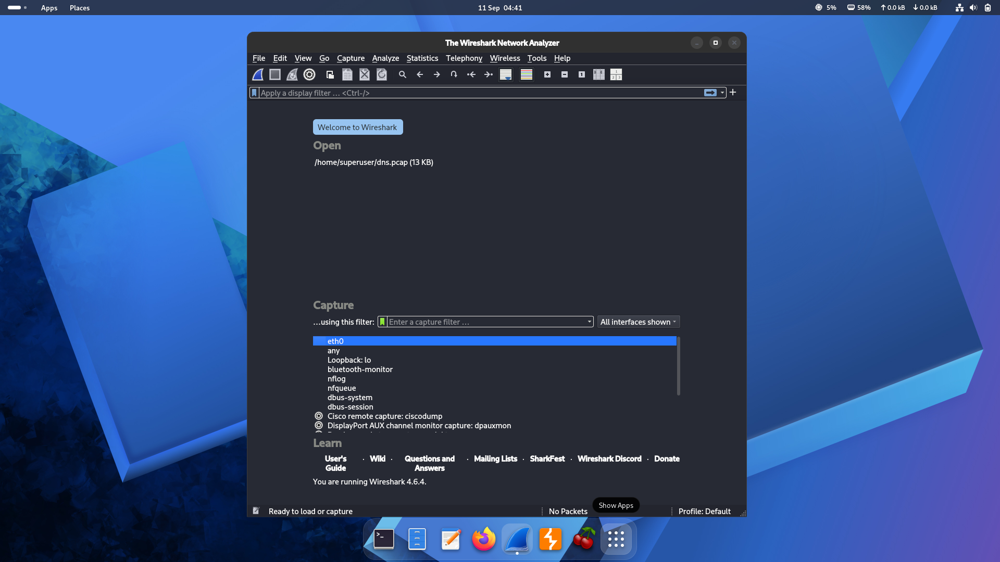
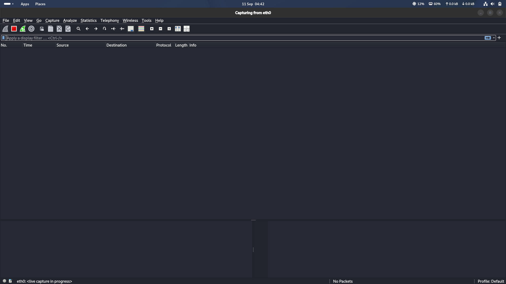
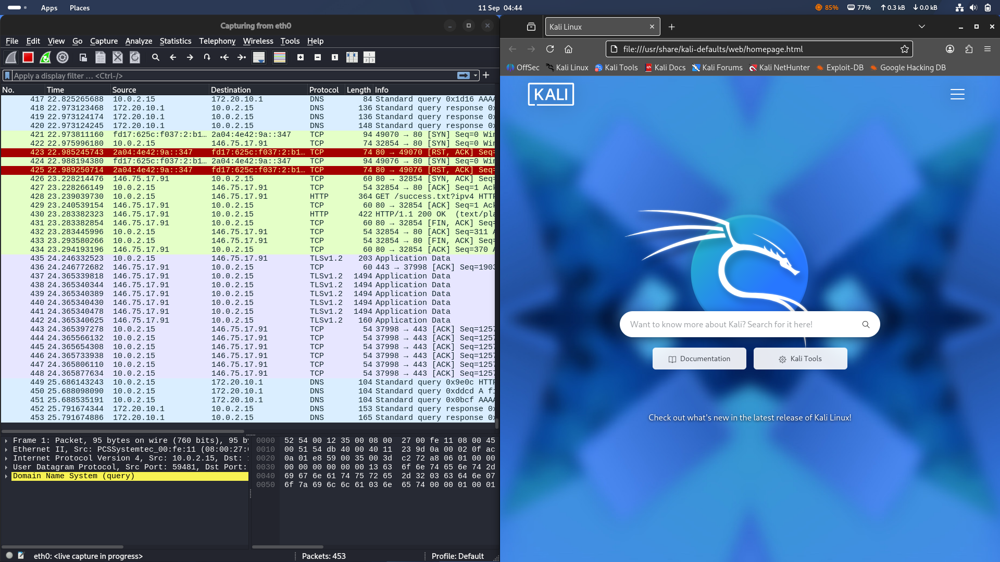
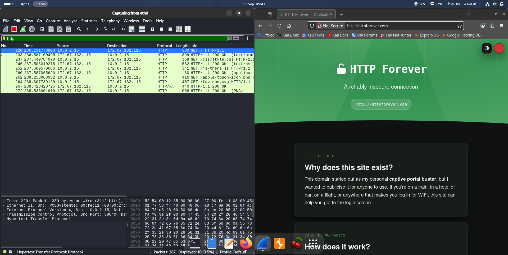
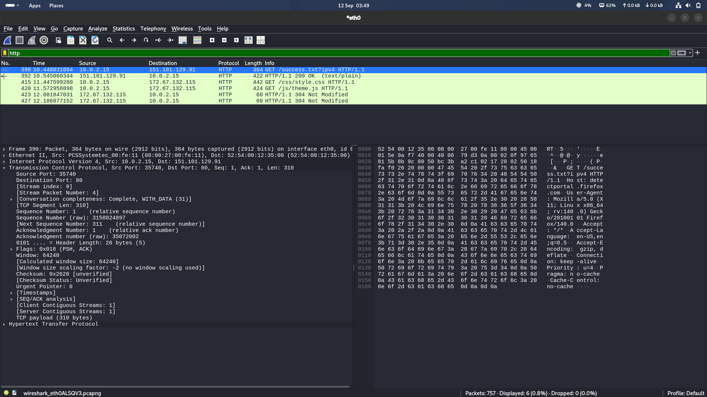

# Wireshark Traffic Analysis — Report

## 1. Setup
Wireshark 4.6.4 was launched on a Kali Linux VM. The `eth0` interface was selected as the capture
target since it showed live traffic activity.

## 2. Starting the capture
A live capture was started on `eth0`. At this point no packets had been captured yet.

## 3. Generating traffic
A web browser was launched to generate realistic traffic. Within seconds, the capture picked up:

- **DNS** queries and responses (e.g., resolving `firefox.settings.services.mozilla.com`)
- **TCP** handshakes (SYN / SYN-ACK / ACK) to remote hosts
- A **plaintext HTTP** request/response — `GET /success.txt?ipv4` — a captive-portal / connectivity
  check request sent with no encryption
- **TLS 1.2 / TLS 1.3** encrypted application traffic

## 4. Full capture review
By the end of the capture (805 packets), the traffic included TLS 1.3 handshakes with visible
**SNI (Server Name Indication)** values such as `ads.mozilla.org`, plus DNS request/response pairs
resolving domains to CNAMEs and A/AAAA records.

## 5. Filtering for plaintext HTTP
To isolate and clearly demonstrate the plaintext HTTP behavior, the display filter `http` was
applied and a deliberately unencrypted site, `httpforever.com` ("A reliably insecure connection"),
was browsed. This produced a clean sequence of HTTP requests/responses:

- `GET / HTTP/1.1` → `200 OK (text/html)`
- `GET /css/style.css` → `200 OK (text/css)`
- `GET /js/theme.js` → `200 OK`
- `GET /apple-touch-icon.png`, `GET /favicon.svg` → `200 OK (PNG)`

Every request and response — page HTML, stylesheet, script, and images — is visible in full,
since none of it is encrypted.

## 6. Inspecting raw packet contents
The `http` filter was applied again on a second capture, this time expanding the packet detail
pane and hex/ASCII view for a single HTTP request to examine exactly what is transmitted at the
byte level.

The selected packet (No. 390) is a `GET /success.txt?ipv4 HTTP/1.1` request — a Firefox
connectivity-check request — sent from `10.0.2.15` to `151.101.129.91` over `TCP` port 80. The
capture also shows the same browsing session loading `httpforever.com` assets (`style.css`,
`theme.js`), with two of those requests answered `304 Not Modified`, meaning the browser's cached
copies were still valid.

**What the packet breakdown reveals, layer by layer:**

- **Ethernet II** — the source and destination MAC addresses (`08:00:27:00:fe:11` →
  `52:54:00:12:35:00`), confirming this is the traffic leaving the local VM's virtual NIC.
- **IPv4** — source `10.0.2.15`, destination `151.101.129.91`, identifying the two endpoints.
- **TCP** — source port `35740`, destination port `80` (plain HTTP), sequence/acknowledgment
  numbers, window size, and PSH+ACK flags marking this as a data-carrying segment that pushes
  the payload straight to the application layer.
- **Hypertext Transfer Protocol** — the actual request, visible in the hex/ASCII pane on the
  right, including:
  - `GET /success.txt?ipv4 HTTP/1.1`
  - `Host: detectportal.firefox.com`
  - `User-Agent: Mozilla/5.0 (X11; Linux x86_64; rv:140.0) Gecko/20100101 Firefox/140.0`
  - `Accept`, `Accept-Language`, `Accept-Encoding`, `Connection: keep-alive`
  - `Cache-Control: no-cache`, `Pragma: no-cache`

**Why this matters:** every one of those header values is sent in cleartext and fully readable
by anyone capturing traffic on the same link. The `User-Agent` string alone fingerprints the
operating system, kernel architecture, browser, and version (Linux x86_64, Firefox 140). Combined
with the `Host` header, an observer can tell exactly which device is talking to which service, and
which software it's running — all without decrypting anything, because there was never any
encryption to begin with. This is the same class of exposure as the earlier `httpforever.com`
capture, but at the byte level instead of the packet-list level, which is why it's a useful
complementary artifact for the writeup: it shows *how* Wireshark reconstructs the request, not
just *that* it can.

## 7. Findings

| Traffic type | Observation | Security implication |
|---|---|---|
| DNS | Queries/responses sent in cleartext (UDP/53) | Anyone on the network path can see every domain a device resolves |
| HTTP | Full GET request and 200 OK response visible in plaintext | Any data in an HTTP request/response (headers, query params, body) is readable by a sniffer |
| TLS 1.2/1.3 | Application data is encrypted | Payload confidentiality is preserved, but... |
| TLS Client Hello (SNI) | Destination hostname sent in cleartext during the handshake | Even encrypted connections leak *which domains* a device is talking to |

## 8. Conclusion
This capture demonstrates why HTTPS-everywhere matters: even a short browsing session leaks
domain-level metadata via DNS and TLS SNI, and any remaining plaintext HTTP traffic is fully
readable by anyone capturing packets on the same network segment. Recommended mitigations include
enforcing HTTPS, using DNS-over-HTTPS/TLS, and considering Encrypted Client Hello (ECH) where
supported, to reduce metadata leakage.
