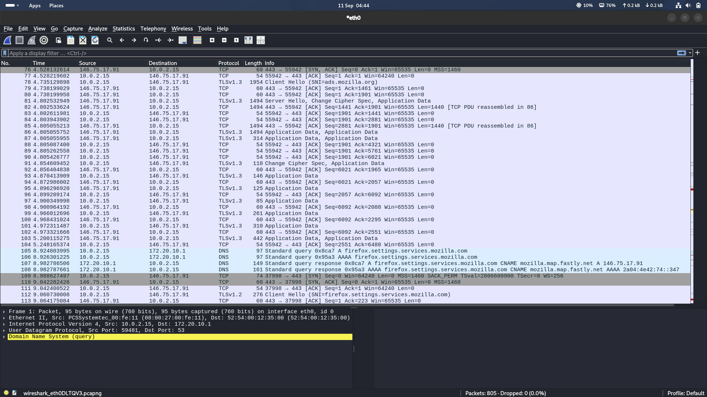

# Wireshark Traffic Analysis — Report

## 1. Setup
Wireshark 4.6.4 was launched on a Kali Linux VM. The `eth0` interface was selected as the capture
target since it showed live traffic activity.

## 2. Starting the capture
A live capture was started on `eth0`. At this point no packets had been captured yet.

## 3. Generating traffic
A web browser was launched to generate realistic traffic. Within seconds, the capture picked up:

- **DNS** queries and responses (e.g., resolving `firefox.settings.services.mozilla.com`)
- **TCP** handshakes (SYN / SYN-ACK / ACK) to remote hosts
- A **plaintext HTTP** request/response — `GET /success.txt?ipv4` — a captive-portal / connectivity
  check request sent with no encryption
- **TLS 1.2 / TLS 1.3** encrypted application traffic

## 4. Full capture review
By the end of the capture (805 packets), the traffic included TLS 1.3 handshakes with visible
**SNI (Server Name Indication)** values such as `ads.mozilla.org`, plus DNS request/response pairs
resolving domains to CNAMEs and A/AAAA records.

## 5. Findings

| Traffic type | Observation | Security implication |
|---|---|---|
| DNS | Queries/responses sent in cleartext (UDP/53) | Anyone on the network path can see every domain a device resolves |
| HTTP | Full GET request and 200 OK response visible in plaintext | Any data in an HTTP request/response (headers, query params, body) is readable by a sniffer |
| TLS 1.2/1.3 | Application data is encrypted | Payload confidentiality is preserved, but... |
| TLS Client Hello (SNI) | Destination hostname sent in cleartext during the handshake | Even encrypted connections leak *which domains* a device is talking to |

## 6. Conclusion
This capture demonstrates why HTTPS-everywhere matters: even a short browsing session leaks
domain-level metadata via DNS and TLS SNI, and any remaining plaintext HTTP traffic is fully
readable by anyone capturing packets on the same network segment. Recommended mitigations include
enforcing HTTPS, using DNS-over-HTTPS/TLS, and considering Encrypted Client Hello (ECH) where
supported, to reduce metadata leakage.
